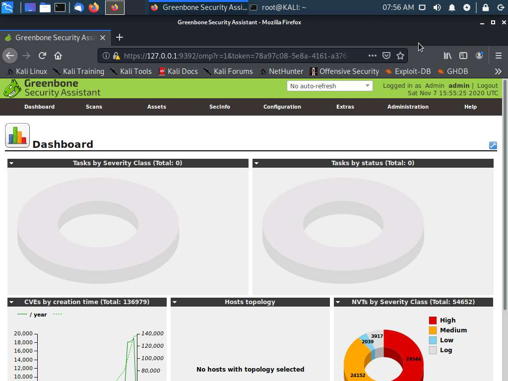

# VI) Risk management

## Analyzing the Results of a Credentialed Vulnerability Scan 

### Scenario 

In this activity, you will explore the capabilities of the OpenVAS ([openvas.org](http://www.openvas.org)) vulnerability scanner and analyze scan reports.

### Run OpenVAS scanner 

OpenVAS can be managed using a web application called Greenbone Security Assistant. On the KALI VM, start the OpenVAS services and log on via the web application.

1. &#x20;Connect to the PT1-Kali VM, and then sign in as root using Pa\$$w0rd as the password.
2. &#x20;In the menu at the top of the desktop, select the **Terminal**.
3.  &#x20;In the terminal window, type openvas-start and press **ENTER**. Wait for the prompt to return.

    If you receive a timeout error, run openvas-start again.

    > It may take one to two minutes for the service to start. You must wait before proceeding to the next steps.
4. &#x20;The **Firefox** browser automatically launches when the openvas-service starts. It connects to https://127.0.0.1:9392
5. &#x20;At the security warning, select **Advanced > Accept the risk and continue**.
6. &#x20;Log on with the Username admin and Password as Pa\$$w0rd.

<figure><figcaption></figcaption></figure>

### Configure credentialed scan 

Use a credentialed scan to get a detailed report. Use the Configuration menu to configure a new credentials object.

1.  &#x20;From the **Configuration** menu, select **Credentials**.

    > If at any time you receive an error message from Greenbone stating "Internal error" with the reference "Could not authenticate to the manager daemon" then retry the step again.
2. &#x20;Select the blue star icon on the left to open the New Credential web dialog box.
3.  &#x20;Complete the dialog box with the following information:

    * Name—enter 515support
    * Allow insecure use—select **Yes**
    * Username—enter 515support\Administrator
    * Password—enter Pa\$$w0rd

    > Vulnerability scans should not use administrative privileges such as the Domain Administrator account used in this activity. Credentialed scans use dedicated logon accounts that have audit or read-only privileges
4.  &#x20;Select **Create**.

    What is the difference between a credentialed and non-credentialed scan? (Choose two)

    Non-credentialed scans use root or administrator privileges.Credentialed scans provide less detail than non-credentialed scans.Non-credentialed scans are performed only by unauthorized hackers.Credentialed scans are performed only by authorized penetration testers.Credentialed scans use dedicated accounts with audit or read-only privileges.Non-credentialed scans provide less detail than credentialed scans.

Correct

> The purpose behind Assisted Labs is to confirm your knowledge and guide you through the given configurations. If you get a scored question incorrect, you may repeat the question and achieve the correct answer. You do not need a correct answer to move forward through the lab.

Credentialed vs non-credentialed scans.

Non-credentialed scans collect publicly-available information. Because credentialed scans rely on administrative access to resources, they can probe deeper to detect vulnerabilities.

### Configure scan target 

The scan scope is the range of hosts or IP addresses that will be assessed. Create a task to scan Windows servers.

1. &#x20;From the **Configuration** menu, select **Targets**.
2. &#x20;Select the blue star icon on the left to open the New Target web dialog box.
3. &#x20;Complete the dialog box with the following information:
   * Name—enter 515support
   * Hosts\_—select **Manual** and enter 10.1.0.1-10.1.0.2 in the box.
   * Credentials—from the SMB list box, select **515support**.
4. &#x20;Select **Create**.

