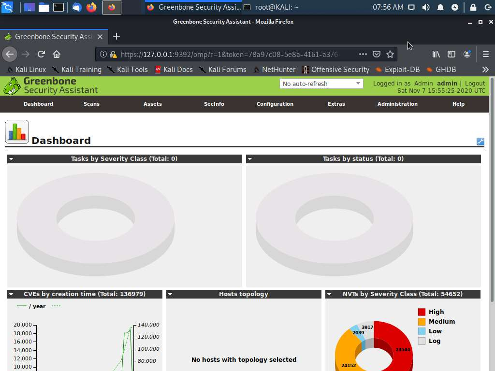

# VI) Risk management

## Analyzing the Results of a Credentialed Vulnerability Scan 

### Scenario 

In this activity, you will explore the capabilities of the OpenVAS ([openvas.org](http://www.openvas.org)) vulnerability scanner and analyze scan reports.

### Run OpenVAS scanner 

OpenVAS can be managed using a web application called Greenbone Security Assistant. On the KALI VM, start the OpenVAS services and log on via the web application.

1. &#x20;Connect to the PT1-Kali VM, and then sign in as root using Pa\$$w0rd as the password.
2. &#x20;In the menu at the top of the desktop, select the **Terminal**.
3.  &#x20;In the terminal window, type openvas-start and press **ENTER**. Wait for the prompt to return.

    If you receive a timeout error, run openvas-start again.

    > It may take one to two minutes for the service to start. You must wait before proceeding to the next steps.
4. &#x20;The **Firefox** browser automatically launches when the openvas-service starts. It connects to https://127.0.0.1:9392
5. &#x20;At the security warning, select **Advanced > Accept the risk and continue**.
6. &#x20;Log on with the Username admin and Password as Pa\$$w0rd.

<figure><figcaption></figcaption></figure>

### Configure credentialed scan 

Use a credentialed scan to get a detailed report. Use the Configuration menu to configure a new credentials object.

1.  &#x20;From the **Configuration** menu, select **Credentials**.

    > If at any time you receive an error message from Greenbone stating "Internal error" with the reference "Could not authenticate to the manager daemon" then retry the step again.
2. &#x20;Select the blue star icon on the left to open the New Credential web dialog box.
3.  &#x20;Complete the dialog box with the following information:

    * Name—enter 515support
    * Allow insecure use—select **Yes**
    * Username—enter 515support\Administrator
    * Password—enter Pa\$$w0rd

    > Vulnerability scans should not use administrative privileges such as the Domain Administrator account used in this activity. Credentialed scans use dedicated logon accounts that have audit or read-only privileges
4.  &#x20;Select **Create**.

    What is the difference between a credentialed and non-credentialed scan? (Choose two)

    Non-credentialed scans use root or administrator privileges.Credentialed scans provide less detail than non-credentialed scans.Non-credentialed scans are performed only by unauthorized hackers.Credentialed scans are performed only by authorized penetration testers.Credentialed scans use dedicated accounts with audit or read-only privileges.Non-credentialed scans provide less detail than credentialed scans.

Correct

> The purpose behind Assisted Labs is to confirm your knowledge and guide you through the given configurations. If you get a scored question incorrect, you may repeat the question and achieve the correct answer. You do not need a correct answer to move forward through the lab.

Credentialed vs non-credentialed scans.

Non-credentialed scans collect publicly-available information. Because credentialed scans rely on administrative access to resources, they can probe deeper to detect vulnerabilities.

### Configure scan target 

The scan scope is the range of hosts or IP addresses that will be assessed. Create a task to scan Windows servers.

1. &#x20;From the **Configuration** menu, select **Targets**.
2. &#x20;Select the blue star icon on the left to open the New Target web dialog box.
3. &#x20;Complete the dialog box with the following information:
   * Name—enter 515support
   * Hosts\_—select **Manual** and enter 10.1.0.1-10.1.0.2 in the box.
   * Credentials—from the SMB list box, select **515support**.
4. &#x20;Select **Create**.

### Configure scan schedule 

Configure the scan to run on a set schedule.

1. &#x20;From the **Configuration** menu, select **Schedules**.
2. &#x20;Select the blue star icon on the left to open the New Schedule web dialog box.
3. &#x20;Complete the dialog box with the following information:
   * Name—515support—Daily
   * First Time—set to the current time
   * Period—**1 day**
   * Duration—**1 hour**
4.  &#x20;Select **Create**.

    > Vulnerability scanning can be disruptive so it is more typical to schedule it for out-of-office hours. On a production network you may also need some mechanism of powering on computers remotely.

### Configure scan task 

Create a task object to complete the configuration, and then run the scan task.

1.  &#x20;From the **Scans** menu, select **Tasks**.

    You may close the "Welcome to the scan task" dialog box that opens.
2. &#x20;Select the blue star icon on the left to open the _New Task_ web dialog box.
3. &#x20;Complete the dialog box with the following information:
   * Name—515support—Full and Fast—Daily
   * Scan Targets—**515support**
   * Schedule—**515support—Daily**
   * Scan Config—**Full and fast**
4.  &#x20;Select **Create**.

    You will run the scan manually to ensure that it works as expected.
5. &#x20;Under Name at the bottom of the screen, select the **515support—Full and Fast—Daily** task.
6. &#x20;Select the **Start** green arrow button to run the scan manually.

### Browse OpenVAS scan report 

Now that you have begun a scan, you need to let it run for a three to four minutes. You can open the report results, even if the scan is not complete.

1. &#x20;From the No auto-refresh box in the green header bar, select **Refresh every 30 seconds**. Let the scan continue to execute while you complete the next step.
2.  &#x20;In the Greenbone web app, select the **Dashboard** link to display current information. The scan is running.

    Let it run for three-four minutes to begin generating report entries.

    > Optionally, you may take a few minutes to browse the default scan configurations (select **Configuration > Scan Configs**. The scan configuration determines the type of tests and probes that are run. Running more detailed tests takes longer, and can carry more risk of crashing the target host.
3.  &#x20;Select **Scans > Reports**.

    You can use this screen to monitor the status of tasks and preview scan results even if the task is not complete.
4.  &#x20;In the **Date** column at the bottom of the Reports page, select the task with today's date to view the results.

    If there are no entries in the report yet, wait a few more minutes. The scan results need to show at least one entry in either High, Medium, or Low Scan Results.

    > Refresh the scan's results regularly.
5. &#x20;Browse the report, and specifically observe the CVE entries.
6.  &#x20;From the small triangle pull down menu by the "Report:Results" title, choose **Report:Hosts** to display the discovered hosts and their related vulnerability information.

    Observe that the same hosts you discovered using the scanning tools in previous labs were also detected in this activity.

    Save the scan results as a compliance check report for use as part of the security audit.
7. &#x20;In the pull-down menu at the upper left of the page, select **HTML** (the menu current reads **Anonymous XML**), and then select the green **Download filtered Report** button.
8. &#x20;When prompted, select **Save File** to download the report to the default **Downloads** folder.
9. Confirm the HTML report file exists.

<figure><figcaption></figcaption></figure>

### Browse OpenVAS scan report 

Now that you have begun a scan, you need to let it run for a three to four minutes. You can open the report results, even if the scan is not complete.

1. &#x20;From the No auto-refresh box in the green header bar, select **Refresh every 30 seconds**. Let the scan continue to execute while you complete the next step.
2.  &#x20;In the Greenbone web app, select the **Dashboard** link to display current information. The scan is running.

    Let it run for three-four minutes to begin generating report entries.

    > Optionally, you may take a few minutes to browse the default scan configurations (select **Configuration > Scan Configs**. The scan configuration determines the type of tests and probes that are run. Running more detailed tests takes longer, and can carry more risk of crashing the target host.
3.  &#x20;Select **Scans > Reports**.

    You can use this screen to monitor the status of tasks and preview scan results even if the task is not complete.
4.  &#x20;In the **Date** column at the bottom of the Reports page, select the task with today's date to view the results.

    If there are no entries in the report yet, wait a few more minutes. The scan results need to show at least one entry in either High, Medium, or Low Scan Results.

    > Refresh the scan's results regularly.
5. &#x20;Browse the report, and specifically observe the CVE entries.
6.  &#x20;From the small triangle pull down menu by the "Report:Results" title, choose **Report:Hosts** to display the discovered hosts and their related vulnerability information.

    Observe that the same hosts you discovered using the scanning tools in previous labs were also detected in this activity.

    Save the scan results as a compliance check report for use as part of the security audit.
7. &#x20;In the pull-down menu at the upper left of the page, select **HTML** (the menu current reads **Anonymous XML**), and then select the green **Download filtered Report** button.
8. &#x20;When prompted, select **Save File** to download the report to the default **Downloads** folder.
9.  Confirm the HTML report file exists.

    Correct

Save the scan.

Ensure that you saved the scan report to the correct location and with the specified file name.

### Comprehensive questions 

Answer the following final comprehensive questions to ensure that you recognize the importance of the activity steps and the uses for the information you have learned.

1.  Which of the following answers best describes the process during this activity?

    Registered discovered vulnerabilities with the CVE database.Used Windows Defender to scan a standalone workstation for vulnerabilities.Created and scheduled a credentialed vulnerability scan task and saved the results.Used a network mapper and protocol analyzer (packet sniffer) to understand the network topology and intercept network traffic.

* Correct
*   Which of the following answers best describes a CVE?

    A specific ransomware attack.Microsoft's online repository of known vulnerabilities.A reference for publicly-known vulnerabilities.An open-source vulnerability scanning utility.

Correct
