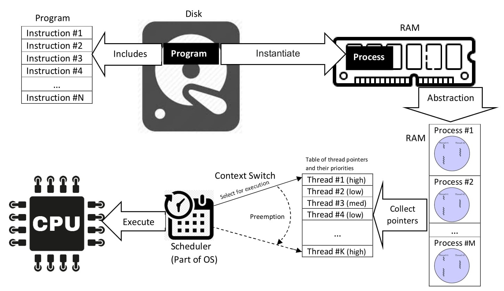

# Process

In computing, a process is the instance of a computer program that is being executed by one or many threads. There are many different process models, some of which are light weight, but almost all processes (even entire virtual machines) are rooted in an operating system (OS) process which comprises the program code, assigned system resources, physical and logical access permissions, and data structures to initiate, control and coordinate execution activity. Depending on the OS, a process may be made up of multiple threads of execution that execute instructions concurrently.

<figure><figcaption></figcaption></figure>

While a computer program is a passive collection of instructions typically stored in a file on disk, a process is the execution of those instructions after being loaded from the disk into memory. Several processes may be associated with the same program; for example, opening up several instances of the same program often results in more than one process being executed.

In general, a computer system process consists of (or is said to own) the following resources:

* An _image_ of the executable [machine code](https://en.wikipedia.org/wiki/Machine_code) associated with a program.
* Memory (typically some region of [virtual memory](https://en.wikipedia.org/wiki/Virtual_memory)); which includes the executable code, process-specific data (input and output), a [call stack](https://en.wikipedia.org/wiki/Call_stack) (to keep track of active [subroutines](https://en.wikipedia.org/wiki/Subroutine) and/or other events), and a [heap](https://en.wikipedia.org/wiki/Heap_memory) to hold intermediate computation data generated during run time.
* Operating system descriptors of resources that are allocated to the process, such as [file descriptors](https://en.wikipedia.org/wiki/File_descriptor) ([Unix](https://en.wikipedia.org/wiki/Unix) terminology) or [handles](https://en.wikipedia.org/wiki/Handle_\(computing\)) ([Windows](https://en.wikipedia.org/wiki/Microsoft_Windows)), and data sources and sinks.
* [Security](https://en.wikipedia.org/wiki/Computer_security) attributes, such as the process owner and the process' set of permissions (allowable operations).
* [Processor](https://en.wikipedia.org/wiki/Central_processing_unit) state ([context](https://en.wikipedia.org/wiki/Context_\(computing\))), such as the content of [registers](https://en.wikipedia.org/wiki/Processor_register) and physical memory addressing. The _state_ is typically stored in computer registry.

The operating system holds most of this information about active processes in data structures called process control blocks. Any subset of the resources, typically at least the processor state, may be associated with each of the process' threads in operating systems that support threads or child processes.

The operating system keeps its processes separate and allocates the resources they need, so that they are less likely to interfere with each other and cause system failures (e.g., deadlock or thrashing). The operating system may also provide mechanisms for inter-process communication to enable processes to interact in safe and predictable ways.
