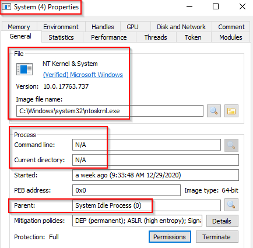

# Processes

## System

"The System process (process ID 4) is the home for a special kind of thread that runs only in kernel mode a kernel-mode system thread. System threads have all the attributes and contexts of regular user-mode threads (such as a hardware context, priority, and so on) but are different in that they run only in kernel-mode executing code loaded in system space, whether that is in Ntoskrnl.exe or in any other loaded device driver. In addition, system threads don't have a user process address space and hence must allocate any dynamic storage from operating system memory heaps, such as a paged or nonpaged pool."

What is unusual behaviour for this process?

* A parent process (aside from System Idle Process (0))
* Multiple instances of System. (Should only be one instance)&#x20;
* A different PID. (Remember that the PID will always be PID 4)
* Not running in Session 0

<figure><figcaption></figcaption></figure>

## SMSS (Session Manager Subsystem)

This process, also known as the Windows Session Manager, is responsible for creating new sessions. It is the first user-mode process started by the kernel.

Each time a user logs onto the system, the initial Session Manager creates a new instance of itself to configure a new session. This new process starts a Win32 subsystem and Winlogon process for the new session. This allows for multiple users to logon at the same time on Windows Server systems.

This process tasks:

* **Windows starts**
  * The **Windows subsystem** is loaded.
    * **Kernel mode part**: `win32k.sys` – talks directly to hardware for things like graphics and input.
    * **User mode parts**: `winsrv.dll` and `csrss.exe` – handle drawing windows, running programs, and console interactions.
* **Session 0 is created** (OS-only space)
  * Runs `wininit.exe`, which starts core system services, win start up application
  * Runs `csrss.exe`, which is runtime process.&#x20;
  * No user interaction happens here — it’s purely for the operating system’s processes.
* **When a user logs in Session X created (X for user login sequence)**
  * The **Session Manager** (smss.exe) creates a **new session** (e.g., Session 1 for the first logged-in user).
  * For this session, it starts:
    * **A new Win32 subsystem** (so applications can run for that user).
    * **`winlogon.exe`** (handles the login process, Ctrl+Alt+Del screen, etc.).
    * **`csrss.exe`** for that session (manages console windows, thread creation, etc.).
* **Multiple users**
  * On systems like **Windows Server**, the Session Manager can repeat this process for multiple users logging in at the same time (e.g., Remote Desktop sessions).
  * Each user gets their own **isolated session** with their own instance of the Win32 subsystem, Winlogon, and csrss.exe — so they don’t interfere with each other

The first child instance creates child instances in new sessions, done by smss.exe copying itself into the new session and self-terminating. You can read more about this process [here](https://en.wikipedia.org/wiki/Session_Manager_Subsystem).

After the boot process is finished, the program resides in memory and can be seen running in the Windows Task Manager. It then waits for either winlogon.exe or csrss.exe to end, at which point Windows will shut down. If the processes do not end in an expected fashion, smss.exe may hang the system, or a bugcheck will occur. It also initiates new user sessions when needed. In some versions of Windows, by using special tools, the critical process status on smss.exe can be removed, after that, it can be terminated without a bluescreen, but any functions that use smss.exe stop working until the next reboot.

The Local Session Manager Service (lsm.exe) sends requests to SMSS through the Asynchronous Local Inter-Process Communication (ALPC) port SmSsWinStationApiPort to start new sessions.

Any other subsystem listed in the `Required` value of `HKLM\System\CurrentControlSet\Control\Session Manager\Subsystems` is also launched.

SMSS is also responsible for creating environment variables, virtual memory paging files and starts winlogon.exe (the Windows Logon Manager).

Normal:

Image Path: %SystemRoot%\System32\smss.exe
\
Parent Process: System
\
Number of Instances: One master instance and child instance per session. The child instance exits after creating the session.
\
User Account: Local System
\
Start Time: Within seconds of boot time for the master instance

<figure><figcaption></figcaption></figure>

Unusual:

* A different parent process other than System (4)
* The image path is different from C:\Windows\System32
* More than one running process. (children self-terminate and exit after each new session)
* The running User is not the SYSTEM user
* Unexpected registry entries for Subsystem

## CSRSS.exe (Client Server Runtime Process)

csrss.exe is the user-mode side of the Windows subsystem. This process is always running and is critical to system operation. If this process is terminated by chance, it will result in system failure. This process is responsible for the Win32 console window and process thread creation and deletion. For each instance, csrsrv.dll, basesrv.dll, and winsrv.dll are loaded (along with others).

This process is also responsible for making the Windows API available to other processes, mapping drive letters, and handling the Windows shutdown process. You can read more about this process [here](https://en.wikipedia.org/wiki/Client/Server_Runtime_Subsystem).

Normal:

Image Path: %SystemRoot%\System32\csrss.exe
\
Parent Process: Created by an instance of smss.exe
\
Number of Instances: Two or more
\
User Account: Local System
\
Start Time: Within seconds of boot time for the first two instances (for Session 0 and 1). Start times for additional instances occur as new sessions are created, although only Sessions 0 and 1 are often created.

\
What is unusual?

* An actual parent process. (smss.exe calls this process and self-terminates)
* Image file path other than C:\Windows\System32
* Subtle misspellings to hide rogue processes masquerading as csrss.exe in plain sight
* The user is not the SYSTEM user.

## Windows Initialization Process, wininit.exe

Windows start-up application is responsible for launching services.exe (Service Control Manager), lsass.exe (Local Security Authority), and lsaiso.exe within Session 0. It is another critical Windows process that runs in the background, along with its child processes. lsaiso.exe is a process associated with Credential Guard and KeyGuard. You will only see this process if Credential Guard is enabled.

Normal:

Image Path: %SystemRoot%\System32\wininit.exe
\
Parent Process: Created by an instance of smss.exe
\
Number of Instances: One
\
User Account: Local System
\
Start Time: Within seconds of boot time

Unusual:

* An actual parent process. (smss.exe calls this process and self-terminates)
* Image file path other than C:\Windows\System32
* Subtle misspellings to hide rogue processes in plain sight
* Multiple running instances
* Not running as SYSTEM

## Service Control Manager (SCM) or services.exe

Service Control Manager (SCM) or services.exe. Its primary responsibility is to handle system services: loading services, interacting with services and starting or ending services. It maintains a database that can be queried using a Windows built-in utility, `sc.exe`.&#x20;

Information regarding services is stored in the registry, `HKLM\System\CurrentControlSet\Services`. \
This process also loads device drivers marked as auto-start into memory.

When a user logs into a machine successfully, this process is responsible for setting the value of the Last Known Good control set (Last Known Good Configuration), `HKLM\System\Select\LastKnownGood`, to that of the CurrentControlSet.&#x20;

This process is the parent to several other key processes: svchost.exe, spoolsv.exe, msmpeng.exe, and dllhost.exe, to name a few. You can read more about this process [here](https://en.wikipedia.org/wiki/Service_Control_Manager).

Normal:

Image Path: %SystemRoot%\System32\services.exe
\
Parent Process: wininit.exe
\
Number of Instances: One
\
User Account: Local System
\
Start Time: Within seconds of boot time

\
What is unusual?

* A parent process other than wininit.exe
* Image file path other than C:\Windows\System32
* Subtle misspellings to hide rogue processes in plain sight
* Multiple running instances
* Not running as SYSTEM

## svchost.exe

The Service Host (Host Process for Windows Services), or svchost.exe, is responsible for hosting and managing Windows services.

#### **What svchost.exe does**

* **svchost.exe** = **Service Host** → A container process that loads and runs **Windows services**.
* Windows services are often written as **DLLs** (not EXEs). DLLs can’t run on their own — they need a “host” to load them into memory.
* **svchost.exe** is that host.

The services running in this process are implemented as DLLs. The DLL to implement is stored in the registry for the service under the `Parameters` subkey in `ServiceDLL`.  Each Windows service has a **registry entry** at:`HKLM\SYSTEM\CurrentControlSet\Services\SERVICE NAME\Parameters`. Parameter **ServiceDLL** → the path to the DLL that implements the service.

<figure><figcaption></figcaption></figure>

There is a key identifier in the binary path, and that identifier is `-k` . This is how a legitimate svchost.exe process is called.  svchost.exe -k netsvcs

* **k** is a **group name** — it tells svchost which group of related services to run together.
* Before Windows 10 v1703, multiple services in the same group would share the same svchost.exe process → fewer processes, less memory used.
* After Windows 10 v1703, if a machine has **more than 3.5 GB RAM**, most services get **their own svchost.exe process** → better isolation, harder for malware to hide.

Since svchost.exe will always have multiple running processes on any Windows system, this process has been a target for malicious use. Adversaries create malware to masquerade as this process and try to hide amongst the legitimate svchost.exe processes. They can name the malware svchost.exe or misspell it slightly, such as scvhost.exe. By doing so, the intention is to go under the radar. Another tactic is to install/call a malicious service (DLL).

Extra reading - [Hexacorn Blog](https://www.hexacorn.com/blog/2015/12/18/the-typographical-and-homomorphic-abuse-of-svchost-exe-and-other-popular-file-names/)

Usual:

Image Path: %SystemRoot%\System32\svchost.exe
\
Parent Process: services.exe
\
Number of Instances: Many
\
User Account: Varies (SYSTEM, Network Service, Local Service) depending on the svchost.exe instance. In Windows 10, some instances run as the logged-in user.
\
Start Time: Typically within seconds of boot time. Other instances of svchost.exe can be started after boot.

What is unusual?

* A parent process other than services.exe
* Image file path other than C:\Windows\System32
* Subtle misspellings to hide rogue processes in plain sight
* The absence of the -k parameter
