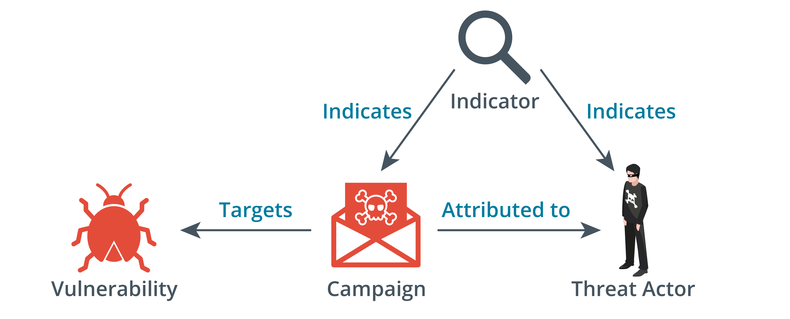

# Threat Data Feeds

When utilizing a cyber threat intelligence (CTI) platform, you enroll in a subscription for a feed of threat data. The data contained within this threat feed can be merged with event data originating from your own network and system logs. An analysis platform undertakes correlation to identify the potential presence of any Indicators of Compromise (IoCs). Various approaches exist for the implementation of a threat data feed.

## Structured Threat Information eXpression (STIX)

The OASIS CTI framework (oasis-open.github.io/cti-documentation) is devised to furnish a structured format for such automated feeds, facilitating the sharing of CTI among organizations. Within this framework, the component known as Structured Threat Information eXpression (STIX) defines standardized terminology for IoCs and methodologies for denoting relationships between them.

## TAXII

STIX serves as the syntax for depicting CTI, while the Trusted Automated eXchange of Indicator Information (TAXII) protocol offers a mechanism to convey CTI data between servers and clients. To illustrate, a CTI service provider manages a repository of CTI data. Subscribers to the service procure data updates for loading into analysis tools via TAXII. This data can be requested by the client (referred to as a collection), or it can be pushed to subscribers (referred to as a channel).

## Automated Indicator Sharing (AIS)

The Department of Homeland Security (DHS) provides Automated Indicator Sharing (AIS), a service enabling companies, particularly ISACs, to engage in threat intelligence exchange (us-cert.gov/ais). Private companies can also participate. AIS is founded on the STIX and TAXII standards and protocols.

## Threat Maps

A threat map is an animated visual representation that reveals the source, target, and nature of attacks detected by a CTI platform. Security solution providers often release such maps depicting global attacks on their clients' systems (fortinet.com/fortiguard/threat-intelligence/threat-map).

## File/Code Repositories

Repositories like virustotal.com host signatures of recognized malware code. These code samples are sourced from live customer systems and, in the case of public repositories, from files uploaded by subscribers.

## Vulnerability Databases and Vulnerability Feeds

Beyond analyzing adversary tactics and behaviors, another wellspring of threat intelligence is identifying vulnerabilities in OS, software applications, and firmware code. Security researchers actively seek vulnerabilities, often motivated by bug bounties offered by vendors. Lists of vulnerabilities are stored in databases like Common Vulnerabilities and Exposures (CVE), operated by Mitre (cve.mitre.org). Information about vulnerabilities is encoded as signatures and scanning scripts, which can be provided as feeds for automated vulnerability scanning software.

## Artificial Intelligence and Predictive Analysis

A threat data feed does not inherently generate threat intelligence. Rather, the combination of security intelligence and CTI data can be processed, correlated, and analyzed to yield actionable insights that aid in the detection of security issues. For instance, security intelligence might unveil a series of DDoS attacks targeted at your web services, originating from various IP addresses, by gathering log and network traffic data. Concurrently, threat intelligence associates these IP addresses with a hacktivist group. By bridging these two intelligence sources, you can discern objectives and strategies linked to that group, implementing controls to mitigate future attacks. Most threat intelligence platforms employ artificial intelligence (AI) in some capacity for correlation analysis. AI and Machine Learning

AI entails crafting machine systems capable of emulating or demonstrating a comparable general intelligence to humans. Initial forms of AI, such as expert systems, employ if-then rules to draw conclusions from a delimited data set known as a knowledge base. Machine learning (ML) utilizes algorithms to dissect input data and subsequently formulate tactics for utilizing that data—like classifying an object or determining the optimal next move in a game. Unlike an expert system, machine learning can adjust the algorithms used for data parsing and strategy development, enabling gradual enhancements in decision-making processes. The structure enabling this learning is referred to as an artificial neural network (ANN). Nodes within a neural network intake inputs and generate outputs through intricate feedback loops between nodes. An ML system possesses objectives and error states, adjusting its neural network to minimize errors and optimize objectives.

Regarding threat intelligence, AI-fueled analysis can potentially achieve precise correlations that would demand extensive analyst hours if done manually. Predictive Analysis

Promptly recognizing signs of a prior attack or the existence of active attack tools within a network is invaluable. However, one of the objectives behind AI-driven threat intelligence is predictive analysis, or threat forecasting. This entails the system anticipating a specific type of attack and potentially identifying the threat actor's identity before the attack fully materializes. For instance, the system tags mentions of a company, related IP addresses, and account names across diverse ingested data sources like dark web platforms, web searches, social media posts, phishing email endeavors, and more. The analysis engine links this "chatter" with IP addresses correlated to a known adversary group. This offers the target advance notice that an attack is in the preliminary stages, affording more time to prepare a robust defense.

As of the current writing, no commercial threat intelligence platform has definitively demonstrated this concrete threat forecasting capability. However, predictive analysis can contribute to risk assessment by delivering more precise, quantified estimations of breach-type event likelihood and impact (cost).
