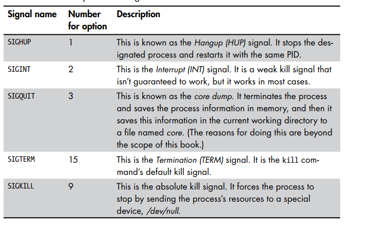

# VI) Risk management

Risk is the likelihood and impact (or consequence) of a threat actor exploiting a vulnerability. Risk assessment involves evaluating both the likelihood and impact of a threat actor exploiting a vulnerability. The process aims to quantify the potential risks that an organization faces and prioritize them based on their significance. Here's a breakdown of the key components of risk assessment:

**Asset** - something of a value for organization that can be compromised: stolen, broken, destroyed.

**Vulnerability:** A vulnerability is a weakness or flaw in a system, software, hardware, or process that could potentially be exploited by a threat actor to compromise the security of the system. Vulnerabilities can be unintentional and may exist due to coding errors, misconfigurations, design flaws, or other factors. Exploiting vulnerabilities can lead to unauthorized access, data breaches, system disruptions, and other security breaches.

**Threat:** A threat refers to any potential danger or harmful event that can exploit vulnerabilities to compromise the security of a system, organization, or individual. Threats can come from various sources, including cybercriminals, hackers, insiders, natural disasters, and more. Threats are not limited to cyberattacks; they encompass any action or event that can result in harm to assets, data, or operations.

Controls: something that was implemented&#x20;

**Risk:** Risk is the potential for loss, damage, harm, or negative impact resulting from the interaction of a threat exploiting a vulnerability. In the context of cybersecurity, risk is the likelihood that a threat will exploit a vulnerability and the impact of that exploitation. Risk assessment involves evaluating the probability of a threat occurring and the potential consequences if it does. Risks can be categorized as low, medium, or high based on their potential impact and likelihood.

In summary:

* **Vulnerability**: Weakness or flaw that can be exploited.
* **Threat**: Potential danger or harmful event that exploits vulnerabilities.
* **Risk**: The potential for loss or harm resulting from the interaction of threats exploiting vulnerabilities.

**Risk**= **Threats** x **Vulnerabilities**(_likelihood_) x **consequences**(_impact_)

<figure><figcaption></figcaption></figure>

<figure><figcaption></figcaption></figure>

The management of vulnerabilities, threats, and risks is a critical aspect of cybersecurity. Organizations employ various strategies, practices, and technologies to identify vulnerabilities, assess threats, and mitigate risks to protect their assets, data, and operations from potential harm.

