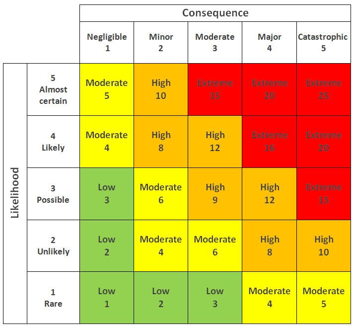

# Risk Analysis

We have two approaches when it comes to risk analysis:

* **Qualitative Risk Analysis**, where we assign ratings to risks. The ratings can be a qualitative adjective, such as high, medium, and low. Alternatively, it can be something symbolic, such as red, yellow, and green.
* **Quantitative Risk Analysis**, where we assign monetary values and use that as a basis for decision-making.

### Qualitative Risk Analysis

As the name suggests, qualitative risk analysis uses qualitative adjectives to describe:

* Probability of a risk-taking place, i.e., probability of a threat exploiting a vulnerability
* Impact of the risk, if realized, which can range between trivial to extreme

<figure><figcaption></figcaption></figure>

### Quantitative Risk Analysis

#### Single Loss Expectancy

Using quantitative analysis, we need to assign monetary values and numeric percentages. Let’s start with the following equation:

$$SLE = AssetValue × EF$$

Where:

* **Single Loss Expectancy (SLE)** is the loss incurred due to the realisation of a threat represented as a monetary value.
* **Asset Value** is the monetary valuation of an asset
* **Exposure Factor (EF)** is the percentage of loss a realised threat can cause to an asset.

#### SLE Numeric Example

Consider the following numeric example for a work laptop considering the threat of a ransomware virus.

* Asset Value = $10,000; the laptop is worth $1000, and the data are worth $9000.
* EF = 90%; a ransomware infection would cause all the data to be unusable.

Consequently,

$$SLE = AssetValue × EF = $10, 000 × 90% = $9, 000$$.

In other words, a ransomware infection for such a work laptop would cause the company to lose $9000, assuming there is no backup copy.

#### Annualised Loss Expectancy

However, this information is insufficient for us to decide on countermeasures. We need to find the expected loss per year.

$$ALE = SLE × ARO$$

Where:

* **Annualised Loss Expectancy (ALE)** is the loss the company expects to lose per year due to the threat.
* **Annualised Rate of Occurrence (ARO)** is the expected number of times this threat is realised yearly, i.e., frequency per year.

Why do we need to calculate ALE? ALE helps us decide whether paying for a particular control or safeguard is justified, as we will see in Task 7.

#### ALE Numeric Example

Let’s revisit our example and calculate the ALE.

* We have already calculated the SLE as $9000; we need to figure out how often we expect this incident to happen yearly.
* Based on experience, a work computer is infected with ransomware once every two years. Hence, the annualised rate of occurrence is 0.5.

Consequently,

$$ALE = SLE × ARO = $9000 × 0.5 = $4, 500$$.

In simple terms, we expect the ransomware threat to cost us **$4500 per laptop per year** unless we take proper measures.

