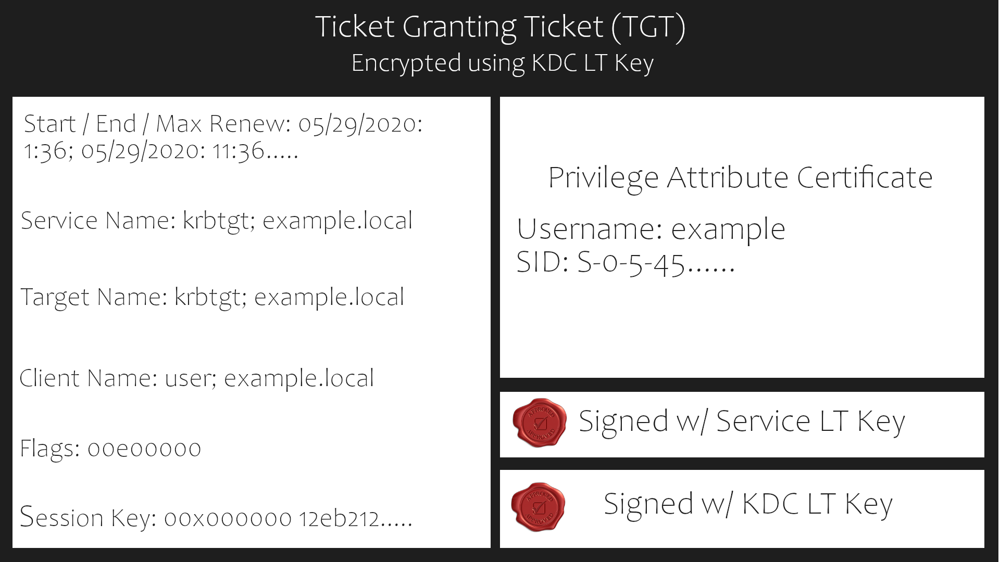
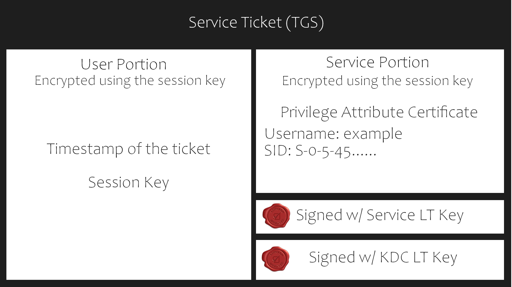

# Kerberos

## Intro

As its primary function, Kerberos distributes tickets, each of which represents a user’s verified identity. The system can use this identity to determine whether the user can access a service, such as a file server. For example, if the user sends their ticket in a request to open a file, the file server can check its validity, then decide whether to grant the user access through something like an access check. Kerberos provides a means of distributing these tickets securely over an untrusted network and allowing the tickets to be verified. It does this by using shared encryption keys, commonly derived from a user’s password, to encrypt and verify the tickets. The Active Directory server never stores the password in plaintext; it stores only the encryption key.

<figure><figcaption></figcaption></figure>

Kerberos is the default authentication service for Microsoft Windows domains. It is intended to be more "secure" than NTLM by using third party ticket authorization as well as stronger encryption.

## Terminology

* **Ticket Granting Ticket (TGT)** - A ticket-granting ticket is an authentication ticket used to request service tickets from the TGS for specific resources from the domain.
* **Key Distribution Center (KDC)** - The Key Distribution Center is a service for issuing TGTs and service tickets that consist of the Authentication Service and the Ticket Granting Service.
* **Authentication Service (AS)** - The Authentication Service issues TGTs to be used by the TGS in the domain to request access to other machines and service tickets.
* **Ticket Granting Service (TGS)** - The Ticket Granting Service takes the TGT and returns a ticket to a machine on the domain.\

* Service Principal Name (SPN) - A Service Principal Name is an identifier given to a service instance to associate a service instance with a domain service account. Windows requires that services have a domain service account which is why a service needs an SPN set.
* KDC Long Term Secret Key (KDC LT Key) - The KDC key is based on the KRBTGT service account. It is used to encrypt the TGT and sign the PAC.
* Client Long Term Secret Key (Client LT Key) - The client key is based on the computer or service account. It is used to check the encrypted timestamp and encrypt the session key.
* Service Long Term Secret Key (Service LT Key) - The service key is based on the service account. It is used to encrypt the service portion of the service ticket and sign the PAC.
* Session Key - Issued by the KDC when a TGT is issued. The user will provide the session key to the KDC along with the TGT when requesting a service ticket.
* Privilege Attribute Certificate (PAC) - The PAC holds all of the user's relevant information, it is sent along with the TGT to the KDC to be signed by the Target LT Key and the KDC LT Key in order to validate the user.

## Ticket granting ticket

<figure><figcaption></figcaption></figure>

## Service Ticket

<figure><figcaption></figcaption></figure>

A service ticket contains two portions: the service provided portion and the user-provided portion. I'll break it down into what each portion contains.

* Service Portion: User Details, Session Key, Encrypts the ticket with the service account NTLM hash.
* User Portion: Validity Timestamp, Session Key, Encrypts with the TGT session key.

##

## Process in detail

<figure><figcaption></figcaption></figure>

AS-REQ - 1.) The client requests an Authentication Ticket or Ticket Granting Ticket (TGT). User encrypts  timestamp NT hash and send it to the AS.&#x20;

AS-REP - 2.) The KDC attempts to decrypt the timestamp using the NT hash from the user to validate the credentials, create a TGT and encrypt it using the krbtgt key. The encrypted TGT and a session key will be sent to the user. These can come in various forms, such as a .kirbi for Rubeus and .ccache for Impacket. A ticket is typically base64 encoded and can be used for multiple attacks.

TGS-REQ - 3.) The client sends the encrypted TGT to the Ticket Granting Server (TGS) with the Service Principal Name (SPN) of the service the client wants to access.

TGS-REP - 4.) The Key Distribution Center (KDC) verifies the TGT of the user and that the user has access to the service. If valid, the KDC will grant the user a service ticket, which can be used to authenticate to the corresponding service, and a valid session key.

AP-REQ - 5.) The client requests the service and sends the valid session key to prove the user has access.

AP-REP - 6.) The service grants access

## Attacks

Privilege Requirements:

* Kerbrute Enumeration - No domain access required&#x20;
* Pass the Ticket - Access as a user to the domain required
* Kerberoasting - Access as any user required
* AS-REP Roasting - Access as any user required
* Golden Ticket - Full domain compromise (domain admin) required&#x20;
* Silver Ticket - Service hash required&#x20;
* Skeleton Key - Full domain compromise (domain admin) required
