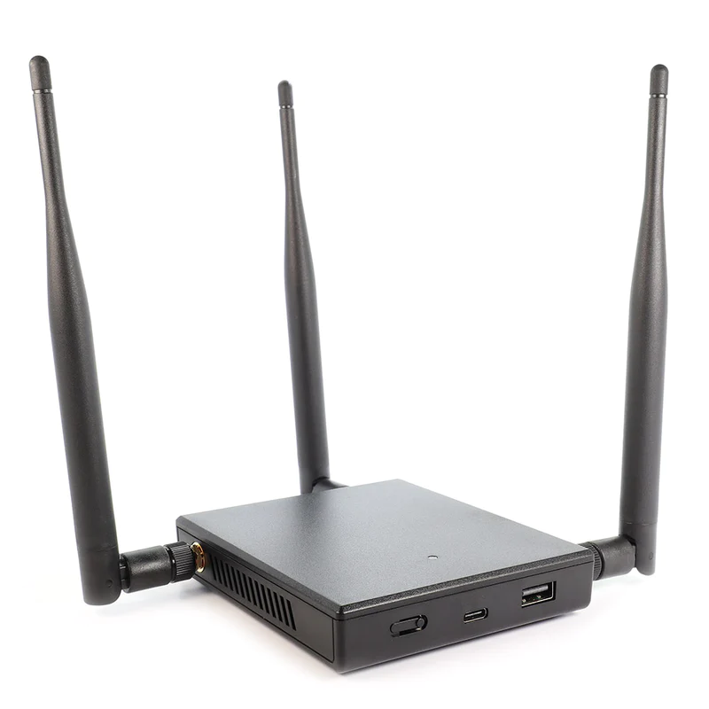

# IDS/IPS

## IDS

An Intrusion Detection System (IDS) is a security tool designed to monitor and analyze network and/or system activities for signs of malicious or unauthorized activities. The primary purpose of an IDS is to identify and respond to security incidents. There are two main types of IDS: Network-based Intrusion Detection Systems (NIDS) and Host-based Intrusion Detection Systems (HIDS).

#### Network-Based Intrusion Detection Systems (NIDS):

1. **Description:**
   * NIDS monitors network traffic in real-time to detect suspicious patterns or anomalies. It analyzes packets and traffic flows to identify potential security threats or attacks.
2. **Different Versions:**
   * **Signature-Based NIDS:**
     * Uses a database of known attack signatures to identify malicious activities. It matches incoming network traffic against these signatures.
   * **Anomaly-Based NIDS:**
     * Establishes a baseline of normal network behavior and triggers alerts or alarms when deviations from this baseline are detected.
   * **Heuristic-Based NIDS:**
     * Uses predefined rules and heuristics to identify abnormal or potentially malicious behavior.
3. **Analysis Techniques:**
   * **Packet Inspection:**
     * Examines individual packets of data to identify known attack patterns or unusual activities.
   * **Traffic Flow Analysis:**
     * Analyzes patterns in network traffic, such as the volume of data, the frequency of connections, or the types of protocols used.
   * **Protocol Analysis:**
     * Monitors and analyzes the usage of network protocols to detect abnormalities or misuse.
   * **Signature Matching:**
     * Compares network traffic against a database of known attack signatures to identify malicious patterns.
   * **Behavioral Analysis:**
     * Builds a profile of normal network behavior and triggers alerts when deviations or anomalies are detected.

#### Host-Based Intrusion Detection Systems (HIDS):

1. **Description:**
   * HIDS monitors activities on individual hosts or endpoints, such as servers, workstations, or other devices. It focuses on detecting abnormal activities or security violations at the host level.
2. **Different Versions:**
   * **Signature-Based HIDS:**
     * Similar to signature-based NIDS, it uses a database of known attack signatures to identify malicious activities on individual hosts.
   * **Anomaly-Based HIDS:**
     * Establishes a baseline of normal host behavior and generates alerts when deviations from this baseline are detected.
3. **Analysis Techniques:**
   * **File Integrity Checking:**
     * Monitors changes to critical system files and alerts on unauthorized modifications.
   * **Registry Monitoring:**
     * Watches for changes to the Windows Registry or other system registries.
   * **Log Analysis:**
     * Analyzes system logs and application logs to identify security-related events.
   * **System Calls and API Monitoring:**
     * Monitors system calls and application programming interfaces (APIs) for suspicious activities.
   * **Behavioral Analysis:**
     * Profiles normal host behavior and generates alerts when deviations or anomalies are detected.

IDS plays a crucial role in network and host security by providing early detection and response capabilities to a wide range of security incidents. Organizations often deploy a combination of NIDS and HIDS, along with other security measures, to create a comprehensive defense-in-depth strategy.

## IPS

Intrusion Prevention System (IPS) is a security technology designed to actively identify, block, or mitigate malicious activities and security threats on a network or system. It is a crucial component of network security, providing real-time protection against various cyber threats. IPS works by monitoring network and/or system activities, analyzing traffic patterns, and taking preventive actions to stop or mitigate potential security incidents.

#### Key Features and Functions of IPS:

1. **Signature-Based Detection:**
   * Similar to intrusion detection systems (IDS), IPS uses signature-based detection to identify known attack patterns and signatures. It maintains a database of signatures associated with known threats and malicious activities.
2. **Behavioral Analysis:**
   * IPS employs behavioral analysis to detect abnormal or malicious behavior that may not be covered by signature-based detection. This involves establishing a baseline of normal network or system behavior and raising alerts when deviations are detected.
3. **Protocol Analysis:**
   * Analyzes network protocols to identify misuse or anomalies in protocol behavior. This helps in detecting and preventing attacks that exploit vulnerabilities in network protocols.
4. **Traffic Anomaly Detection:**
   * Monitors network traffic for unusual patterns or anomalies that may indicate a security threat. This can include unexpected spikes in traffic, unusual port scans, or other abnormal network behavior.
5. **Content Inspection:**
   * Inspects the content of network traffic, including payload and application data, to detect and block malicious content or exploits. This is particularly important for preventing attacks that attempt to exploit vulnerabilities in applications or services.
6. **Vulnerability-Based Protection:**
   * Protects against known vulnerabilities by actively blocking exploitation attempts. This includes preventing attacks targeting vulnerabilities in operating systems, applications, or network services.
7. **Inline Prevention:**
   * Operates in-line with network traffic, allowing the IPS to take immediate action to block or allow traffic based on its analysis. This real-time response is a key feature of IPS.
8. **Blocking and Mitigation:**
   * Actively blocks or mitigates security threats by taking actions such as dropping malicious packets, resetting connections, or blocking specific IP addresses.
9. **Logging and Reporting:**
   * Provides detailed logs and reports on security events, including detected threats, blocked activities, and overall network security posture. This information is valuable for incident response and forensic analysis.
10. **Integration with Security Ecosystem:**
    * Often integrates with other security technologies, such as firewalls, antivirus solutions, and security information and event management (SIEM) systems, to provide a comprehensive security posture.
11. **Adaptive Security:**
    * Some modern IPS solutions leverage machine learning and artificial intelligence to adapt to evolving threats and improve the accuracy of threat detection.

#### IPS Deployment Models:

1. **Network-Based IPS (NIPS):**
   * Monitors and analyzes network traffic, providing protection at the network layer. It is typically deployed at strategic points within the network infrastructure.
2. **Host-Based IPS (HIPS):**
   * Installed on individual hosts or endpoints to monitor and protect against threats specific to those hosts. HIPS is particularly useful for protecting servers and critical systems.
3. **Virtual or Cloud-Based IPS:**
   * Deployed in virtualized or cloud environments to provide protection for virtual machines or cloud-based infrastructure. This ensures security in dynamic and scalable environments.

IPS plays a critical role in enhancing the overall security posture of networks and systems by actively preventing and mitigating security threats. It is often used in conjunction with other security technologies to create a robust defense-in-depth strategy.


[network-taps.md](network-taps.md)


## WIDS

Wireless Intrusion Detection System (WIDS) is a security technology designed to monitor and analyze wireless network traffic for signs of unauthorized access, security threats, or anomalous behavior. WIDS is a crucial component of wireless network security, providing organizations with the means to detect and respond to potential threats to their wireless infrastructure. Here are key aspects of Wireless Intrusion Detection:

#### Key Features and Functions of Wireless Intrusion Detection:

1. **Packet Inspection:**
   * WIDS monitors wireless network traffic by inspecting packets for unusual or suspicious patterns. It analyzes the content of data packets to identify potential security threats.
2. **Detection of Rogue Access Points:**
   * Identifies and locates unauthorized or rogue access points within the wireless network. Rogue access points can pose security risks by providing an entry point for attackers.
3. **Anomaly Detection:**
   * Uses anomaly detection techniques to identify abnormal patterns of behavior within the wireless network. This includes detecting unusual traffic patterns, connection attempts, or device behavior.
4. **Signature-Based Detection:**
   * Utilizes signature-based detection to identify known attack patterns and malicious activities in wireless traffic. Signature databases are regularly updated to address new threats.
5. **Device Profiling:**
   * Builds profiles of authorized devices within the wireless network, including information about device types, manufacturers, and typical behavior. This helps in detecting unauthorized or unknown devices.
6. **Encryption Monitoring:**
   * Monitors the use of encryption protocols within the wireless network. It ensures that proper encryption mechanisms are in place and alerts on any attempts to use insecure or compromised encryption.
7. **Security Policy Enforcement:**
   * Enforces security policies related to wireless network usage. This may include policies on device authentication, encryption standards, and acceptable use of the wireless network.
8. **Wireless Intrusion Prevention:**
   * In some cases, WIDS systems may include intrusion prevention capabilities, allowing them to take active measures to block or mitigate detected threats. This is often referred to as Wireless Intrusion Prevention System (WIPS).
9. **Monitoring Signal Strength and Coverage:**
   * Monitors the signal strength and coverage of wireless networks to identify areas of potential vulnerability or interference.
10. **Logging and Reporting:**
    * Provides detailed logs and reports on detected security events, unauthorized access attempts, and the overall security posture of the wireless network.

#### Deployment of Wireless Intrusion Detection:

1. **Dedicated WIDS Devices:**
   * Organizations may deploy dedicated WIDS devices that are specifically designed to monitor and analyze wireless network traffic. These devices may be strategically placed within the network infrastructure.
2. **Integrated WIDS/WIPS Solutions:**
   * Some wireless access points and network infrastructure devices come with integrated WIDS/WIPS capabilities. These solutions provide a seamless integration of intrusion detection and prevention within the wireless network.
3. **Cloud-Based WIDS:**
   * With the rise of cloud-based services, there are also cloud-based WIDS solutions that offer the advantage of centralized monitoring and management for geographically distributed wireless networks.

<figure><figcaption>
Wifi pineaple
</figcaption></figure>

#### Benefits of Wireless Intrusion Detection:

1. **Improved Security Posture:**
   * WIDS enhances the overall security of wireless networks by detecting and responding to potential security threats.
2. **Early Threat Detection:**
   * Provides early detection of unauthorized access attempts, rogue devices, and potential security incidents in the wireless environment.
3. **Compliance:**
   * Helps organizations comply with security and privacy regulations by actively monitoring and securing their wireless networks.
4. **Visibility and Control:**
   * Offers visibility into wireless network activities, allowing organizations to exert control over their wireless infrastructure.
5. **Reduced Risk of Wireless Attacks:**
   * By identifying and mitigating potential threats, WIDS helps in reducing the risk of wireless attacks, data breaches, and unauthorized access.

Wireless Intrusion Detection is an integral part of securing modern wireless networks, and its deployment is particularly important in environments where wireless connectivity is prevalent, such as enterprise networks, public Wi-Fi, and industrial IoT environments.
