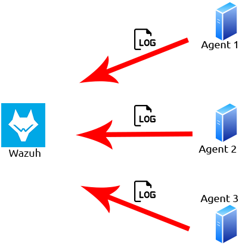

# Wazuh

EDR solutions are exactly. Endpoint detection and response (EDR) are a series of tools and applications that monitor devices for an activity that could indicate a threat or security breach. These tools and applications have features that include:

* Auditing a device for common vulnerabilities
* Proactively monitoring a device for suspicious activity such as unauthorised logins, brute-force attacks or privilege escalations
* Visualising complex data and events into neat and trendy graphs
* Recording a device's normal operating behaviour to help with detecting anomalies


Created in 2015, [Wazuh](https://wazuh.com) is an open-source, freely available and extensive EDR solution. It can be used in all scales of environments. Wazuh operates on a management and agent module. Simply, a device is dedicated to running Wazuh named a manager, where Wazuh operates on a management and agent model where the manager is responsible for managing agents installed on the devices you’d like to monitor. Let's look at this model in the diagram below:

<figure><figcaption></figcaption></figure>


## **Wazuh Agent Configuration & Adding New Logs**

Devices that record the events and processes of a system are called agents. Agents monitor the processes and events that take place on the device, such as authentication and user management. Agents will offload these logs to a designated collector for processing, such as Wazuh.

In order for Wazuh to be populated, agents need to be installed onto devices to log such events. Wazuh can guide you through the agent deployment process provided with agent wizard.


### 1. Wazuh Agent Configuration:

The main configuration file for the Wazuh agent is:

**Linux/Mac:** `/var/ossec/etc/ossec.conf`

**Windows:** `C:\Program Files (x86)\ossec-agent\ossec.conf`

So now edit the agent configuration file:

```
<agent_config>
  <client>
    <server>
      <address>192.168.1.100</address>  <!-- Wazuh Manager IP -->
      <port>1514</port>  <!-- Communication Port -->
      <protocol>tcp</protocol>
    </server>
  </client>
</agent_config>
```

**Steps:**

1. Replace **192.168.1.100** with your **Wazuh Manager IP**.
2. Ensure the **port (1514/UDP or TCP)** is open between the agent and manager.
3. Restart the agent to apply changes:&#x20;

```
systemctl restart wazuh-agent
```

### 2. Adding New Logs to Wazuh

Edit the **ossec.conf** file on the agent to tells Wazuh to monitor `/var/log/custom_app.log` as a syslog file.:

```
<localfile>
  <log_format>syslog</log_format>
  <location>/var/log/custom_app.log</location>
</localfile>
```

After editing the configuration, restart the agent:

```
systemctl restart wazuh-agent
```

For Windows:

```shell-session
net stop wazuh-agent
net start wazuh-agent
```

#### 3: Define a Custom Rule (Needed for Alerts & Dashboard Visibility)

nano /var/ossec/rules/custom\_rules.xml

Write a **custom rule** :

```
<group name="custom_rules">
  <rule id="100002" level="5">
    <decoded_as>custom_app</decoded_as>
    <description>Custom Application Event: User performed an action</description>
  </rule>
</group>

```

Enable custom\_rules.xml in Wazuh Manager ensure it’s loaded in `/var/ossec/etc/ossec.conf`:

```
<ruleset>
  <include>custom_rules.xml</include>
</ruleset>
```

```
systemctl restart wazuh-manager
```


### Auditing Linux Commands

Frst, we will need to install the `auditd` package and an `auditd` plugin. This may already be installed on your system; however, let’s install it to make sure. Let’s run the command `sudo apt-get install auditd audispd-plugins` and enable this service to run currently as well as on boot.`sudo systemctl enable auditd.service` & `sudo systemctl start auditd.service`

We will need to configure `auditd` to create a rule for the commands and events that we wish for it to monitor. In this task, we will be telling `auditd` to monitor for any commands executed as root.

You can extend this to monitor commands such as `tcpdump`, `netcat`, or _catting_ files such as _/etc/passwd_, which are all hallmarks of a breach.\


`Auditd` rules are located in the following directory: `/etc/audit/rules.d/audit.rules`. We will be adding our rules manually.

For this task, we will need to open this _audit.rules_ file and append our rule ourselves. First, let’s edit the file using `sudo nano /etc/audit/rules.d/audit.rules` and appending `-a exit,always -F arch=64 -F euid=0 -S execve -k audit-wazuh-c`


We will now need to inform audits of this new rule, so let's run this command `sudo auditctl -R /etc/audit/rules.d/audit.rules` to now read the new _audit.rules_ file that we appended to in the previous task.

Now, let’s configure the system that is running a Wazuh agent that we wish to monitor these events on. We’ll be monitoring a Linux host in this case, so like in our previous tasks, we will need to configure the Wazuh agent to detect this new log file that is generated by `auditd` like so `sudo nano /var/ossec/etc/ossec.conf` and add the `auditd` log like so:


```
<localfile>
    <location>/var/log/audit/audit.log</location>
    <log_format>audit</log_format>
</localfile>
```


## Custom Alert Rules in Wazuh

