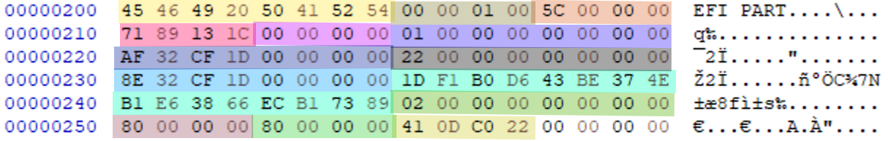
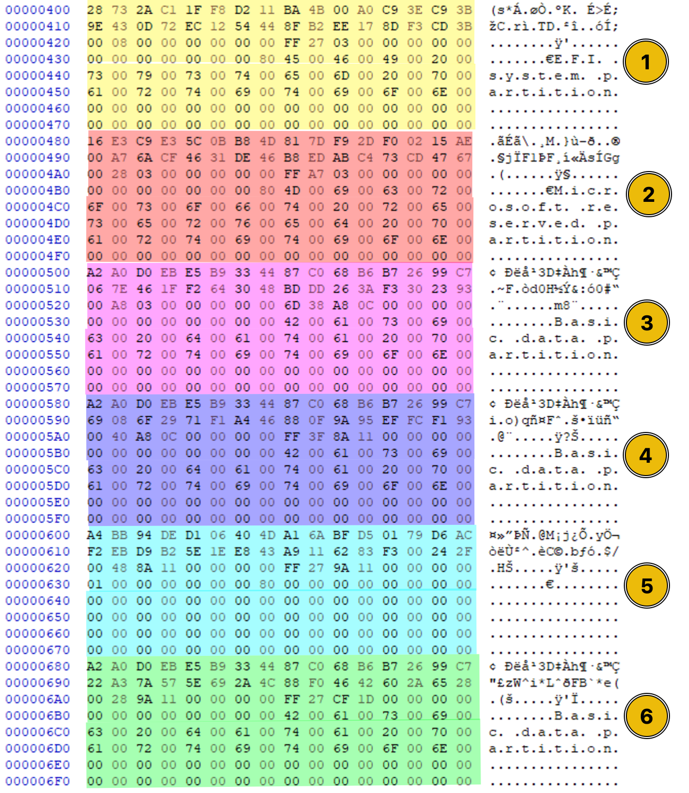
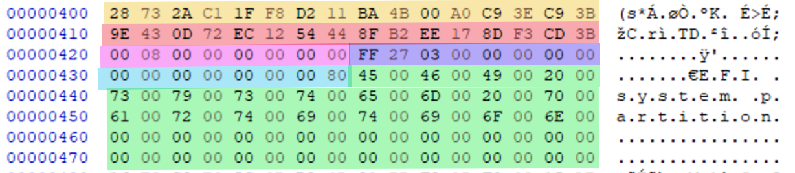

# GPT

UEFI firmware with the GPT partitioning scheme replaced BIOS firmware with the MBR partitioning scheme.

* **Protective MBR** - if the disk is GPT partitioned, the system should have UEFI firmware to handle it. However, some legacy systems still use BIOS firmware even though the disk is GPT partitioned. This can be a problem as the BIOS firmware is designed to work with the MBR and UEFI firmware is designed to work with the GPT. To solve this problem, the GPT has Protective MBR. The Protective MBR is in the disk's first sector, partitioned with the GPT. The purpose of the Protective MBR is to signal the BIOS system that this disk is using the GPT, so please don't mess up with it thinking that it is the MBR.
* Primary GPT header
* Partition Entry Array
* Backup GPT header
* Backup partition entry array

| Addresses          | Name                               |                                                                                                                                                                                                                                                                       |
| ------------------ | ---------------------------------- | --------------------------------------------------------------------------------------------------------------------------------------------------------------------------------------------------------------------------------------------------------------------- |
| 00000000-000001BD  | **Protective MBR** Bootloader Code |                                                                                                                                                                                                                                                                       |
| 000001BE-0000001FD | **Protective MBR** Partition Table | This partition table contains only one partition (the first 16 bytes), and this partition has one job; to redirect the system to the EFI Partition                                                                                                                    |
| 000001FE-0000001FF | MBR Signature                      | The MBR signature is the same as in the standard MBR. It is set to `55 AA` and marks the end of the Protective MBR.                                                                                                                                                   |
| 00000200-000003FF  | Primary GPT header                 | The GPT header starts right from the next byte (the start of sector 1) after the Protective MBR ends at `55 AA` (the end of sector 0). It acts as a blueprint of the partitions on the disk. All the bytes in the GPT header have a specific meaning. 512 Bytes size. |
| 00000400-00004400  | Partition Entry Array              | Partition Entry Array of a GPT disk. Each partition entry is represented by 128 bytes (00000400-0000047F)                                                                                                                                                             |
|                    | Backup partition entry array       |                                                                                                                                                                                                                                                                       |

### Protective MBR

1. Bootloader Code: This bootloader code is not the same as it is in the general MBR. This bootloader code does not perform any function during the boot process. It is just there to look like it's the same standard MBR bootloader. This would be all 00s in most scenarios; however, sometimes, this can contain some placeholder code for legacy compatibility.
2. Partition Table: This partition table contains only one partition (the first 16 bytes), and this partition has one job; to redirect the system to the EFI Partition (which we will discuss later). The screenshot of the protective MBR above shows that it only has one partition in the table, and the other partitions are labeled with 0s. In this single partition, there is only one important thing: the 4th byte. This byte is set to `EE`, indicating that this is a GPT-formatted disk.&#x20;

\

<figure><figcaption></figcaption></figure>

3\. MBR Signature: The MBR signature is the same as in the standard MBR. It is set to `55 AA` and marks the end of the Protective MBR.

### Primary GPT Header

The GPT header starts right from the next byte (the start of sector 1) after the Protective MBR ends at `55 AA` (the end of sector 0). It acts as a blueprint of the partitions on the disk. All the bytes in the GPT header have a specific meaning. Below is a screenshot of the GPT header with these bytes highlighted with different colors. It has the whole 512 sector space but occupies the first 92 bytes of space, and after these 92 bytes, there would be all `00` bytes for padding purposes to complete the sector's total bytes. So, for the Primary GPT header, you only need to focus on the first 92 bytes, which can give you some meaningful information.

<figure><figcaption></figcaption></figure>

**LBA (Logical Block Addressing)** refers to the numbering of disk sectors.

* Each LBA corresponds to one **sector** on the disk.
* On most systems, 1 LBA = **512 bytes** (or sometimes 4096 bytes).
* Examples:
  * `LBA 0` → MBR (legacy)
  * `LBA 1` → GPT Header
  * `LBA 2–33` → Partition Entry Array
  * `LBA 2048+` → Start of actual partitions

To calculate the exact address through these LBAs, you must follow the same steps we performed while locating the partition in the MBR task. These steps included reversing the bytes stored in a little-endian format, then converting them to decimals and searching them on the HxD tool to jump to the exact LBA location.

| Byte Range | Length | Field Name                     | Explanation                                                                                       |
| ---------- | ------ | ------------------------------ | ------------------------------------------------------------------------------------------------- |
| **0–7**    | 8      | `Signature`                    | ASCII `"EFI PART"` (Hex: `45 46 49 20 50 41 52 54`) identifies this as a GPT header.              |
| **8–11**   | 4      | `Revision`                     | GPT version (usually `00 00 01 00` → **1.0**, little-endian).                                     |
| **12–15**  | 4      | `Header Size`                  | Size of the header in bytes (e.g., `5C 00 00 00` = **92 bytes**).                                 |
| **16–19**  | 4      | `CRC32 of Header`              | CRC32 checksum of the header (with this field zeroed out). Used for integrity checks.             |
| **20–23**  | 4      | `Reserved`                     | Must be all zeros.                                                                                |
| **24–31**  | 8      | `Current LBA`                  | LBA where this GPT header is located (typically sector **1**).                                    |
| **32–39**  | 8      | `Backup LBA`                   | LBA of the **backup GPT header** (usually last sector of the disk).                               |
| **40–47**  | 8      | `First Usable LBA`             | First LBA available for partitions (after GPT structures).                                        |
| **48–55**  | 8      | `Last Usable LBA`              | Last LBA available for partitions (before backup GPT structures).                                 |
| **56–71**  | 16     | `Disk GUID`                    | Globally Unique Identifier for the disk. Used to identify the disk independently of device names. |
| **72–79**  | 8      | `Partition Entry Array LBA`    | Starting LBA of the **partition entry array** (typically sector 2).                               |
| **80–83**  | 4      | `Number of Partition Entries`  | How many entries the GPT can hold (usually **128**).                                              |
| **84–87**  | 4      | `Size of Each Partition Entry` | Size in bytes (typically **128 bytes**).                                                          |
| **88–91**  | 4      | `CRC32 of Partition Array`     | CRC32 checksum of the entire partition entry array. Ensures data integrity.                       |

<figure><figcaption></figcaption></figure>

1. Signature: This field has a value `45 46 49 20 50 41 52 54` which recognizes it as a GPT header. This value is always at the start of the GPT header.
2. Revision: The revision number is of 4 bytes and it represents the version of the GPT. Most of the times it would be `00 00 01 00` which means the GPT version is 1.0.
3. Header Size: This field represents the size of the GPT header. It is typically `5C 00 00 00` in hex and if you convert it to decimal (after reversing the order of bytes as they are in little-endian), it is 92 bytes which is the length of the GPT header.
4. CRC32 of Header: This is the CRC32 checksum of the GPT header, which if changed, would indicate that either the GPT header is tampered or corrupted.
5. Reserved: These are reserved bytes. The purpose of having them is to utilize them for any future changes in the GPT header.
6. Current LBA: The Current Logical Block Address (LBA) indicates the location of the GPT header. We know that its location is in sector 1, and we can verify this by converting the 8 Current LBA bytes `01 00 00 00 00 00 00 00` into decimal.
7. Backup LBA: In the GPT partitioning scheme, we have a backup of the GPT header as well, which we will be studying later on in this task. This field indicates the LBA of the backup GPT header.
8. First Usable LBA: This LBA address indicates the first address from which the partition can start on the disk.
9. Last Usable LBA: This LBA address indicates the last address to which the partitions on the disk can be written. Any partitions cannot occupy the disk space after the last usable LBA.
10. Disk GUID: This field is of 16 bytes and it presents a Globally Unique Identifier of the disk. The purpose of this GUID is to distinguish the disk from any other disks present in the system. In the current GPT header that we are analyzing, these bytes are `1D F1 B0 D6 43 BE 37 4E B1 E6 38 66 EC B1 73 89`. We can convert them to the standard GUID format of the disk by just reformatting them as `1DF1B0D6-43BE-374E-B1E6-3866ECB17389`.
11. Partition Entry Array LBA: This LBA address indicates the start of the Partition Entry Array which we are going to discuss ahead as the 3rd component of the GPT.
12. Number of Partition Entries: This field indicates the number of partitions that are on the disk. The GPT supports 128 partitions, unlike the MBR, which supports 4 partitions only. The value of this field is `80 00 00 00` which if converted to decimal will be 128.
13. Size of Each Partition Entry: This field indicates the size occupied by each partition entry array. In this example, it set to `80 00 00 00` which is 128 in decimal. It is important to note that this is not the size of the partition itself. This is just the size of partition entry array that we would be discussing next.
14. CRC32 of Partition Array: This is the CRC32 checksum of the whole partition entry array, which if changed, would indicate that either the partition entry array is tampered or corrupted.

### Partition Entry Array

We saw that sector zero was occupied by the Protective MBR, and the GPT header occupied sector 1. Now, from sector 2, the Partition Entry Array starts, just like the partition table present in the MBR, with a few differences. There are a total of 128 partitions on a GPT disk, and this partition entry array contains information about all these partitions.  Below is the screenshot of the Partition Entry Array of a GPT disk. Each partition entry is represented by 128 bytes.  You can only see the 6 partition entries out of the total 128 partition entries of the GPT. This is because there are only six working partitions in this disk. These six partitions would be present in blocks (128 bytes each) in this partition entry array, and after these working partitions, all the remaining 122 partition entries would be marked with `00`. &#x20;

<figure><figcaption></figcaption></figure>

The screenshot below shows the first partition entry from the partition entry array of the GPT. All the bytes (or groups of bytes) have some specific meaning. We have highlighted the different byte groups with different colors.

<figure><figcaption></figcaption></figure>

28 73 2A C1 1F F8 D2 11 BA 4B 00 A0 C9 3E C9 3B 9E 43 0D 72 EC 12 54 44 8F B2 EE 17 8D F3 CD 3B 00 08 00 00 00 00 00 00 FF 27 03 00 00 00 00 00 00 00 00 00 00 00 00 80 45 00 46 00 49 00 20 00 73 00 79 00 73

| Position | Length | Bytes                                           | Field name            |
| -------- | ------ | ----------------------------------------------- | --------------------- |
| 0-15     | 16     | 28 73 2A C1 1F F8 D2 11 BA 4B 00 A0 C9 3E C9 3B | Partition type (GUID) |
| 16-31    | 16     | 9E 43 0D 72 EC 12 54 44 8F B2 EE 17 8D F3 CD 3B | Unique Partition GUID |
| 32-39    | 16     | 00 08 00 00 00 00 00 00                         | Starting LBA          |
| 40-47    | 8      | FF 27 03 00 00 00 00 00                         | Ending LBA            |
| 48-55    | 8      | 00 00 00 00 00 00 00 80                         | Attributes            |
| 56-127   | 72     | 45 00 46 00 49 00 20 00 73 00 79 00 73 ...      | Partition Name        |

EFI System Partition (ESP) is stored as a partition on every GPT disk and it is a very critical component in the boot process. In the MBR, we saw that the bootloaders are located in the bootcode and the bootable partition. In contrast, in the GPT, the bootloader is comprised of multiple files with .efi extension, and they all are stored in this EFI System Partition (ESP). Once the bootloader is found from the EFI System Partition, it loads the Operating System's kernel from the bootable partition of the disk, and after that, the drivers, services, and filesystems are loaded into the memory. Then the user is given the control of OS interface.

1. Unique Partition GUID: Unique Partition GUID is used to distinguish partitions on a disk. It is a unique GUID that is given to all the partitions on the disk. To convert these hexadecimal bytes into the standard GUID format, you can follow the same steps as we did for the first field (Partition Type GUID), as this is also stored in the mixed endian format.
2. Starting LBA: The starting LBA address indicates the area from where this partition starts on the disk.&#x20;
3. Ending LBA: The ending LBA address indicates the area at which this partition is ending on the disk.
4. Attributes: This field contains some flags that indicates some features of the partition, for example, if it is bootable, hidden, or normal.
5. Partition Name: This is the last field of the partition entry, and its size is 72 bytes. It represents the name of the partition in string format and is UTF-16 encoded. If you decode these bytes using any online hex-to-string decoder, you will get the partition name of this partition.

### Backup GPT Header

One of the biggest reasons the GPT replaced the MBR is its redundancy. In case of the MBR, if your MBR gets corrupted or changed due to hardware issues or malicious attacks, you have a minimal chance of recovery. On the other hand, the GPT has backups of its components. The Backup GPT Header is located at the last sector of the disk, and it can be used for recovery in case the Primary GPT Header is corrupted. It contains the same information as the Primary GPT Header.

### Backup Partition Entry Array

There is also a backup copy of the partition entry array. It is stored at the end of the disk just before the backup GPT header. It contains the same information as the partition entry array. It acts as a fail-safe mechanism in case the original partition entry array is damaged.
