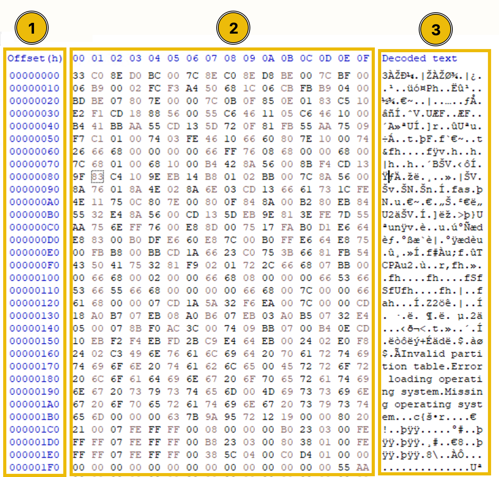
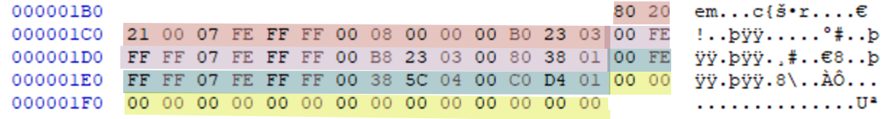

# Master Boot Record

## The Master Boot Record&#x20;

(MBR) takes up 512 bytes of space at the very first sector of the disk. Now, we know that it starts from the very first sector. We can easily analyze the MBR code by starting from the first line, but how do we know where this MBR code ends? The answer to this question is straightforward. Every two digits coupled in hexadecimal represents 1 byte, and once the first 512 bytes of the disk completes, the MBR has been ended. So, in the hexadecimal editor we are using, 16 bytes are present in each row, meaning that the first 32 rows of the disk would be the whole MBR. Another way to spot the end is by looking at the MBR signature. The MBR signature is represented by `55 AA`, which marks the end of the MBR code. You can look for these hexadecimal digits to identify where the MBR ends.

The screenshot below shows the MBR portion (first 512 bytes) of a disk when opened into the hex editor. You can see that these are the first 32 rows (16 bytes for each row) and ending at 55 AA (MBR Signature).&#x20;

| Offset (Lines or h) |                                            |                                                                                                                                                                                                                                                                                                                                                                                            |
| ------------------- | ------------------------------------------ | ------------------------------------------------------------------------------------------------------------------------------------------------------------------------------------------------------------------------------------------------------------------------------------------------------------------------------------------------------------------------------------------ |
| 00000000-000001B0   | Bootstrap code (446 bytes)(Bytes 0-445)    | This Bootloader code contains the **Initial Bootloader**. The initial bootloader is the first thing that executes in the MBR. This initial bootloader code has a primary purpose of finding the bootable partition from the **partition table** present on the MBR.                                                                                                                        |
| 000001B0-000001F0   | Partitions table (64 bytes)(Bytes 446-509) | This table contains the details of all the partitions present on the disk. One of the partitions in the disk contains all the operating system files necessary for booting, known as a bootable partition. The initial bootloader that was started from the bootloader code of the MBR finds the bootable partition from this partition table, and it loads the second bootloader from it. |
| 000001F0            | MBR signature (2 bytes)                    |                                                                                                                                                                                                                                                                                                                                                                                            |

<figure><figcaption></figcaption></figure>

### Partitions Table (Bytes 446-509)

An MBR disk has a total of 4 partitions, and each partition is represented by 16 bytes in the partition table. In the screenshot below, four partitions (each with 16 bytes) are highlighted with different colors

<figure><figcaption></figcaption></figure>

| Position | Length | Bytes       | Field Name           |
| -------- | ------ | ----------- | -------------------- |
| 0        | 1      | 80          | Boot indicator       |
| 1-3      | 3      | 20 21 00    | Starting CHS address |
| 4        | 1      | 07          | Partition table type |
| 5-7      | 3      | FE FF FF    | Ending CHS Address   |
| 8-11     | 4      | 00 08 00 00 | Starting LBA Address |
| 12-15    | 4      | 00 B0 23 03 | Number of sectors    |

* Boot indicators - tells if partition is bootable or not. A bootable partition contains files necessary for the operating system to boot. IF 80 - bootable, if 00 - no bootable.
* **Starting CHS Address -** physical Cylinder Head Sector (CHS) is the 3 bytes that tell you where this partition is starting from on the disk. It will give you the starting physical address of the partition, such as the cylinder, head, and sector number.
* Every partition uses a filesystem such as NTFS, FAT32, etc. This byte indicates the filesystem of the partition. The partition we are taking as a reference has this byte as `07`, which means it is an NTFS partition. Every filesystem has its own unique byte. You can learn about the bytes used for other filesystems from [here](https://www.writeblocked.org/resources/MBR_GPT_cheatsheet.pdf).
* **Ending CHS Address:** The last 3 bytes at the end of the CHS Address indicates the physical location where the partition ends on the disk.
* **Starting LBA Address:** Logical Block Addressing (LBA) is the logical address that indicates the start of the partition. We saw that the Starting CHS Address also gives us the starting address of the partition, but because CHS gives you the physical address of the partition, it becomes difficult for us to locate it. However, the Starting LBA Address gives you the logical address of the partition rather than the physical address.
* **Number of Sectors:** These last 4 bytes of a partition tell you the number of sectors in the partition. We will calculate the sector's size by using this field ahead.

