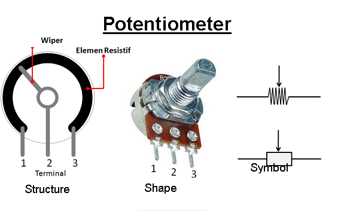

# Potentiometer

<figure><figcaption></figcaption></figure>

**Potentiometer (POT)** is one type of [Resistor](https://www.techtarget.com/whatis/definition/resistor) whose Resistance Value can be adjusted according to the needs of the Electronic Circuit or the needs of the wearer. Potentiometer are a family of resistors that belong to the Variable Resistor Category.

Basically the important parts in the Potentiometer Component are:

1. Sweeper or also called Wiper
2. Resistive Element
3. Terminal
