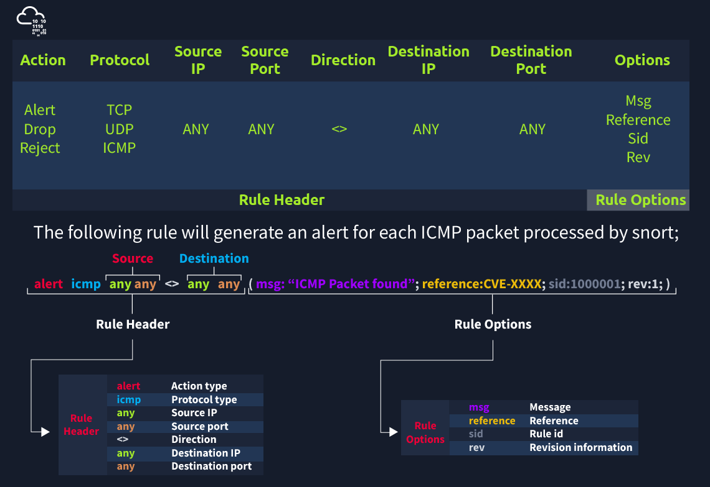

# Snort

_Snort has three primary uses:_&#x20;

_As a packet sniffer like tcpdump;_

_As a packet logger ;_&#x20;

_As a full-blown network intrusion prevention system;_


Capabilities of Snort;<br>
--------------------------

* Live traffic analysis
* Attack and probe detection
* Packet logging
* Protocol analysis
* Real-time alerting
* Modules & plugins
* Pre-processors
* Cross-platform support! (Linux & Windows)

Snort has three main use models;<br>

* Sniffer Mode - Read IP packets and prompt them in the console application.
* Packet Logger Mode - Log all IP packets (inbound and outbound) that visit the network.
* NIDS (Network Intrusion Detection System)  and NIPS (Network Intrusion Prevention System) Modes - Log/drop the packets that are deemed as malicious according to the user-defined rules.


## Basics

| Parameter      | Description                                                                                            |
| -------------- | ------------------------------------------------------------------------------------------------------ |
| -V / --version | This parameter provides information about your instance version.                                       |
| -c             | Identifying the configuration file                                                                     |
| -T             | Snort's self-test parameter, you can test your setup with this parameter.                              |
| -q             | Quiet mode prevents snort from displaying the default banner and initial information about your setup. |

## Sniffer Mode

| Display parameter | Description                                                                                                                                                    |
| ----------------- | -------------------------------------------------------------------------------------------------------------------------------------------------------------- |
| -v                | Verbose. Display the TCP/IP output in the console.                                                                                                             |
| -d                | <p>Display the packet data (payload). (More data then verbose mode).<br></p>                                                                                   |
| -e                | <p>Display the link-layer (TCP/IP/UDP/ICMP) headers. <br></p>                                                                                                  |
| -X                | Display the full packet details in HEX. (All data)                                                                                                             |
| -i                | This parameter helps to define a specific network interface to listen/sniff. Once you have multiple interfaces, you can choose a specific interface to sniff.  |

Note that you can use the parameters both in combined and separated form as follows;<br>

* snort -v
* snort -vd
* snort -de
* snort -v -d -e
* snort -X

\
Snort parameters: -i, -v, -d, -e, -X, -i


## Packet logger

Snort will start showing the packets and log them in the target directory.

`sudo snort -dev -l .`

ASCII mode provides multiple files in human-readable format, so it is possible to read the logs easily by using a text editor.

`sudo snort -dev -K ASCII -l .`

ASCII mode provides multiple files in human-readable format, so it is possible to read the logs easily by using a text editor.


## Log reader

```shell-session
sudo snort -r snort.log.1638459842
```

Snort can read and handle the binary like output (tcpdump and Wireshark also can handle this log format). However, if you create logs with "-K ASCII" parameter, Snort will not read them. As you can see in the above output, Snort read and displayed the log file just like in the sniffer mode.


snort log reading with tcpdump:

```shell-session
sudo tcpdump -r snort.log.1638459842 -ntc 10
```

"-r" parameter also allows users to filter the binary log files. You can filter the processed log to see specific packets with the "-r" parameter and Berkeley Packet Filters (BPF).&#x20;

* `sudo snort -r logname.log -X`
* `sudo snort -r logname.log icmp`
* `sudo snort -r logname.log tcp`
* `sudo snort -r logname.log 'udp and port 53'`


IDS/IPS Mode

| Parameter | Description                                                                                                                                                                                                                                                                                                                                                                                                                                                                                                                                                                                        |
| --------- | -------------------------------------------------------------------------------------------------------------------------------------------------------------------------------------------------------------------------------------------------------------------------------------------------------------------------------------------------------------------------------------------------------------------------------------------------------------------------------------------------------------------------------------------------------------------------------------------------- |
| -c        | Defining the configuration file.                                                                                                                                                                                                                                                                                                                                                                                                                                                                                                                                                                   |
| -T        | Testing the configuration file.                                                                                                                                                                                                                                                                                                                                                                                                                                                                                                                                                                    |
| -N        | <p>Disable logging.<br></p>                                                                                                                                                                                                                                                                                                                                                                                                                                                                                                                                                                        |
| -D        | <p>Background mode.<br></p>                                                                                                                                                                                                                                                                                                                                                                                                                                                                                                                                                                        |
| -A        | <p>Alert modes;<br></p><p><strong>full</strong>: Full alert mode, providing all possible information about the alert. This one also is the default mode; once you use -A and don't specify any mode, snort uses this mode.</p><p><strong>fast</strong>:  Fast mode shows the alert message, timestamp, source and destination IP, along with port numbers.</p><p><strong>console</strong>: Provides fast style alerts on the console screen.</p><p><strong>cmg</strong>: CMG style, basic header details with payload in hex and text format.</p><p><strong>none</strong>: Disabling alerting.</p> |

Remember that there are several alert modes available in snort;<br>

* console: Provides fast style alerts on the console screen.
* cmg: `sudo snort -c /etc/snort/snort.conf -A cmg`
* full: Full alert mode, providing all possible information about the alert.<br>
* fast: `sudo snort -c /etc/snort/snort.conf -A fast`
* none: Disabling alerting.

Investigator

Combine reading and alert rules:

* snort.conf: _Main configuration file._
* local.rules: _User-generated rules file._

`sudo snort -c /etc/snort/snort.conf -A full -l . -r mx-1.pcap`

`sudo snort -c rules.local -A full -l . -r mx-1.pcap`


## Alert logic

<figure><figcaption></figcaption></figure>

There are three main rule options in Snort;<br>

* General Rule Options - Fundamental rule options for Snort.&#x20;
* Payload Rule Options - Rule options that help to investigate the payload data. These options are helpful to detect specific payload patterns.
* Non-Payload Rule Options - Rule options that focus on non-payload data. These options will help create specific patterns and identify network issues.

| Msg                  | <p>The message field is a basic prompt and quick identifier of the rule. Once the rule is triggered, the message filed will appear in the console or log. Usually, the message part is a one-liner that summarises the event.<br></p>                                                                                                                                                                                                                                                                                                                                    |
| -------------------- | ------------------------------------------------------------------------------------------------------------------------------------------------------------------------------------------------------------------------------------------------------------------------------------------------------------------------------------------------------------------------------------------------------------------------------------------------------------------------------------------------------------------------------------------------------------------------ |
| <p>Sid<br></p>       | <p>Snort rule IDs (SID) come with a pre-defined scope, and each rule must have a SID in a proper format. There are three different scopes for SIDs shown below.</p><ul><li>&#x3C;100: Reserved rules</li><li>100-999,999: Rules came with the build.</li><li>>=1,000,000: Rules created by user.</li></ul><p>Briefly, the rules we will create should have sid greater than 100.000.000. Another important point is; SIDs should not overlap, and each id must be unique. </p>                                                                                           |
| <p>Reference<br></p> | <p>Each rule can have additional information or reference to explain the purpose of the rule or threat pattern. That could be a Common Vulnerabilities and Exposures (CVE) id or external information. Having references for the rules will always help analysts during the alert and incident investigation.<br></p>                                                                                                                                                                                                                                                    |
| <p>Rev<br></p>       | <p>Snort rules can be modified and updated for performance and efficiency issues. Rev option help analysts to have the revision information of each rule. Therefore, it will be easy to understand rule improvements. Each rule has its unique rev number, and there is no auto-backup feature on the rule history. Analysts should keep the rule history themselves. Rev option is only an indicator of how many times the rule had revisions.</p><p>alert icmp any any &#x3C;> any any (msg: "ICMP Packet Found"; sid: 100001; reference:cve,CVE-XXXX; rev:1;)<br></p> |

<br>

| <p>Content<br></p>      | <p>Payload data. It matches specific payload data by ASCII, HEX or both. It is possible to use this option multiple times in a single rule. However, the more you create specific pattern match features, the more it takes time to investigate a packet.</p><p>Following rules will create an alert for each HTTP packet containing the keyword "GET". This rule option is case sensitive!</p><ul><li>ASCII mode - alert tcp any any &#x3C;> any 80  (msg: "GET Request Found"; content:"GET"; sid: 100001; rev:1;)</li><li>HEX mode - alert tcp any any &#x3C;> any 80  (msg: "GET Request Found"; content:"|47 45 54|"; sid: 100001; rev:1;)</li></ul>                                                                                                |
| ----------------------- | -------------------------------------------------------------------------------------------------------------------------------------------------------------------------------------------------------------------------------------------------------------------------------------------------------------------------------------------------------------------------------------------------------------------------------------------------------------------------------------------------------------------------------------------------------------------------------------------------------------------------------------------------------------------------------------------------------------------------------------------------------- |
| <p>Nocase<br></p>       | Disabling case sensitivity. Used for enhancing the content searches.alert tcp any any <> any 80  (msg: "GET Request Found"; content:"GET"; nocase; sid: 100001; rev:1;)                                                                                                                                                                                                                                                                                                                                                                                                                                                                                                                                                                                  |
| <p>Fast_pattern<br></p> | <p>Prioritise content search to speed up the payload search operation. By default, Snort uses the biggest content and evaluates it against the rules. "fast_pattern" option helps you select the initial packet match with the specific value for further investigation. This option always works case insensitive and can be used once per rule. Note that this option is required when using multiple "content" options. </p><p>The following rule has two content options, and the fast_pattern option tells to snort to use the first content option (in this case, "GET") for the initial packet match.<br></p><p>alert tcp any any &#x3C;> any 80  (msg: "GET Request Found"; content:"GET"; fast_pattern; content:"www";  sid:100001; rev:1;)</p> |


| ID                | Filtering the IP id field.alert tcp any any <> any any (msg: "ID TEST"; id:123456; sid: 100001; rev:1;)                                                                                                                            |
| ----------------- | ---------------------------------------------------------------------------------------------------------------------------------------------------------------------------------------------------------------------------------- |
| <p>Flags<br></p>  | <p>Filtering the TCP flags.</p><ul><li>F - FIN</li><li>S - SYN</li><li>R - RST</li><li>P - PSH</li><li>A - ACK</li><li>U - URG</li></ul><p>alert tcp any any &#x3C;> any any (msg: "FLAG TEST"; flags:S;  sid: 100001; rev:1;)</p> |
| <p>Dsize<br></p>  | <p>Filtering the packet payload size.</p><ul><li>dsize:min&#x3C;>max;</li><li>dsize:>100</li><li>dsize:&#x3C;100</li></ul><p>alert ip any any &#x3C;> any any (msg: "SEQ TEST"; dsize:100&#x3C;>300;  sid: 100001; rev:1;)</p>     |
| <p>Sameip<br></p> | Filtering the source and destination IP addresses for duplication.alert ip any any <> any any (msg: "SAME-IP TEST";  sameip; sid: 100001; rev:1;)                                                                                  |


More info&#x20;

[http://manual-snort-org.s3-website-us-east-1.amazonaws.com/](http://manual-snort-org.s3-website-us-east-1.amazonaws.com/)
